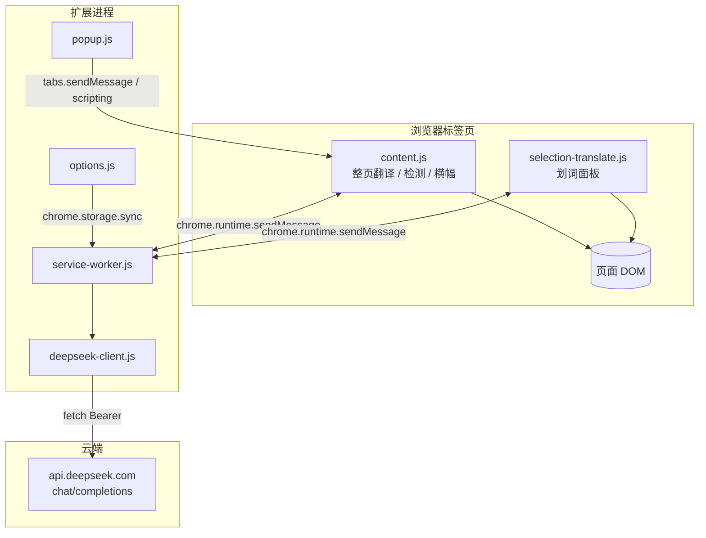
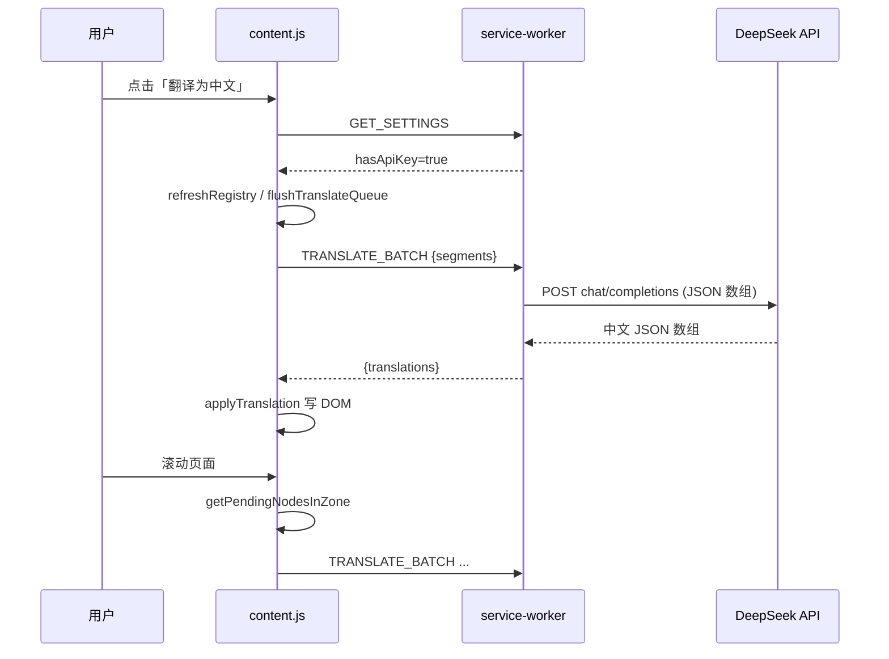
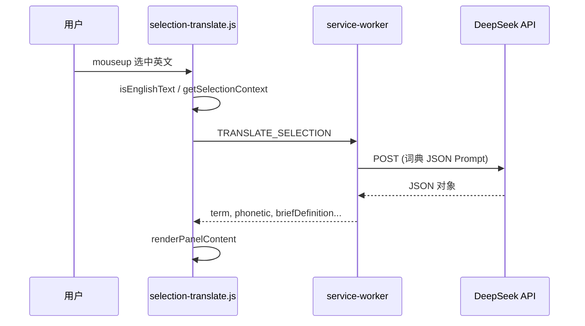

# 英文网页翻译助手 — 技术实现文档

> 文档版本：v1.1.2  
> 架构：Chrome Extension Manifest V3  
> 翻译引擎：DeepSeek Chat Completions API

---

## 1. 系统架构

### 1.1 总体架构图



### 1.2 进程与职责

| 模块                      | 运行环境              | 职责                                                |
| ------------------------- | --------------------- | --------------------------------------------------- |
| `content.js`              | 隔离世界 · 内容脚本   | 语言检测、横幅 UI、DOM 文本收集与替换、逐步翻译调度 |
| `selection-translate.js`  | 隔离世界 · 内容脚本   | 划词监听、浮动面板、TTS/复制                        |
| `service-worker.js`       | Service Worker        | 消息路由、配置读取、批量/划词 API 调度              |
| `deepseek-client.js`      | Service Worker（ESM） | DeepSeek HTTP 封装、JSON 批量解析、降级逐条翻译     |
| `popup.js` / `options.js` | 扩展页面              | 用户配置与快捷操作                                  |
| `constants.js`            | 共享模块              | 存储键、消息类型、阈值常量                          |

### 1.3 通信协议

内容脚本与后台通过 `chrome.runtime.sendMessage` 通信，统一响应格式：

```json
{ "ok": true, "data": { ... } }
{ "ok": false, "error": "错误信息" }
```

| 消息类型 `type`       | 方向          | 载荷                     | 返回                                                             |
| --------------------- | ------------- | ------------------------ | ---------------------------------------------------------------- |
| `GET_SETTINGS`        | CS/Popup → BG | —                        | `enabled`, `autoPrompt`, `selectTranslate`, `hasApiKey`, `model` |
| `TRANSLATE_BATCH`     | CS → BG       | `{ segments: string[] }` | `{ translations: string[] }`                                     |
| `TRANSLATE_SELECTION` | CS → BG       | `{ text, context }`      | 词典 JSON 字段                                                   |
| `UPDATE_MODEL`        | CS → BG       | `{ model }`              | `{ model }`                                                      |
| `SHOW_TRANSLATE_BAR`  | Popup → CS    | —                        | —                                                                |
| `RUN_DETECT`          | Popup → CS    | —                        | —                                                                |

---

## 2. 核心实现说明

### 2.1 语言检测

**实现位置**：`content.js`（内联实现，与 `language-detector.js` 逻辑一致）

**流程**：

1. `getDeclaredLanguage()`：读 `html[lang]`、`meta[http-equiv=content-language]`
2. `collectVisibleText()`：TreeWalker 收集可见文本，**`isInsideSkipContainer()`** 排除 `pre/code` 等
3. `analyzeScriptRatios()`：统计拉丁字母与 CJK 占比
4. `detectEnglishPage()`：综合声明语言与占比阈值（拉丁 ≥55%，CJK 阻断 ≥12%）

**触发时机**：`DOMContentLoaded` 后 800ms、2500ms 各一次；`sessionStorage` 键 `ds-translator-dismissed` 可抑制本会话提示。

### 2.2 整页逐步翻译

**状态机**（`lazySession`）：

```
inactive → active（用户点击翻译）
  → refreshRegistry() 收集待译节点
  → flushTranslateQueue() 翻译视口内批次
  → IntersectionObserver / scroll / mutation 触发后续批次
  → checkAllComplete() 无剩余节点 → 完成
```

**文本节点筛选**（`collectTextNodes`）：

- `NodeFilter.SHOW_TEXT` 遍历
- 拒绝：`isInsideSkipContainer`、`data-ds-translated` 祖先、隐藏元素、无英文字母、长度 <2

**跳过容器**（关键修复）：

```javascript
const SKIP_SELECTOR = 'script,style,noscript,iframe,svg,code,pre,textarea,input,select,option';

function isInsideSkipContainer(node) {
  return !!node.parentElement?.closest(SKIP_SELECTOR);
}
```

> 说明：hljs 等高亮库在 `<pre><code>` 内用 `<span>` 包裹单词，必须对**祖先**判断，不能只检查直接父元素。

**翻译应用**（`applyTranslation`）：

- 父元素写入 `data-ds-original`（首次）
- 替换 `node.textContent` 为中文
- 标记 `data-ds-translated="1"`

**区域调度**：

- `getZoneBottomPx()` = `innerHeight * 1.2`（视口 + 下方 20%）
- `IntersectionObserver` 的 `rootMargin` 底部 20%
- 滚动防抖 `SCROLL_DEBOUNCE_MS = 120`
- Mutation 防抖 300ms

### 2.3 批量翻译 API

**实现位置**：`deepseek-client.js` → `translateBatch()`

**策略**：

1. 单段：直接 `translateWithDeepSeek`
2. 多段：System Prompt 要求返回 **纯 JSON 数组**，与输入等长
3. `parseTranslationJsonArray()` 解析，去除 markdown 围栏
4. 失败或空项：`translateBatchSequential()` 逐条降级
5. `sanitizeTranslation()` 清除历史 `<<<SEG>>>` 分隔符污染

**后台分批**（`service-worker.js`）：

- 每批最多 15 条（`MAX_ITEMS_PER_BATCH`）
- 字符上限 `MAX_CHARS_PER_BATCH = 3500`（含 JSON 开销估算）

### 2.4 划词翻译

**实现位置**：`selection-translate.js`

**流程**：

1. `mouseup` 延迟 180ms 读取 `window.getSelection()`
2. `isEnglishText()` 校验（拉丁占比、CJK 阻断）
3. `getSelectionContext()` 取最近块级元素文本（≤1200 字）
4. `TRANSLATE_SELECTION` → `translateSelection()` 返回结构化 JSON
5. 面板渲染：词典区 + AI 上下文区；支持固定、朗读、复制

**存储联动**：监听 `chrome.storage.onChanged` 同步 `selectTranslate` 与 `enabled`。

### 2.5 配置与密钥

| 存储键            | 类型    | 默认值          |
| ----------------- | ------- | --------------- |
| `deepseekApiKey`  | string  | —               |
| `deepseekModel`   | string  | `deepseek-chat` |
| `autoPrompt`      | boolean | `true`          |
| `enabled`         | boolean | `true`          |
| `selectTranslate` | boolean | `false`         |

**本地配置导入**：扩展安装/启动时 `fetch(chrome.runtime.getURL("config.local.json"))`，仅当 storage 无 Key 时写入。

---

## 3. 项目目录大纲明细

```
translator/                          # 项目根目录
│
├── manifest.json                    # MV3 清单：权限、content_scripts、SW 入口
├── README.md                        # 用户向安装与使用说明
├── .gitignore                       # 忽略 node_modules、密钥、config.local.json
├── .env.example                     # 开发参考（扩展不读取）
├── config.local.json.example        # 本地 API Key 模板（扩展可读取）
├── config.local.json                # 【本地】实际密钥（git 忽略，可选）
│
├── icons/                           # 扩展图标资源
│   ├── icon16.png
│   ├── icon48.png
│   └── icon128.png
│
├── docs/                            # 产品与技术文档
│   ├── 需求功能文档.md
│   └── 技术实现文档.md              # 本文档
│
└── src/
    │
    ├── background/                  # 后台 Service Worker（ES Module）
    │   └── service-worker.js        # 消息分发、配置加载、批量翻译编排
    │
    ├── content/                     # 注入网页的内容脚本（IIFE，无 import）
    │   ├── content.js               # 语言检测、横幅、逐步翻译、DOM 替换
    │   ├── content.css              # 顶部横幅样式
    │   ├── selection-translate.js   # 划词翻译面板逻辑
    │   └── selection-panel.css      # 划词面板样式
    │
    ├── popup/                       # 浏览器工具栏弹出页
    │   ├── popup.html               # Popup 结构
    │   ├── popup.js                 # 状态展示、开关、触发翻译/检测
    │   └── popup.css                # Popup 样式
    │
    ├── options/                     # 扩展选项页（chrome://extensions → 选项）
    │   ├── options.html             # API Key、模型、行为开关表单
    │   ├── options.js               # 读写 chrome.storage.sync
    │   └── options.css              # 选项页样式
    │
    └── shared/                      # 后台共享模块（ES Module）
        ├── constants.js             # API URL、存储键、MSG 类型、批量上限
        ├── deepseek-client.js       # DeepSeek 请求、批量 JSON、划词 JSON 解析
        └── language-detector.js     # 独立语言检测库（当前 content 内联副本）
```

### 3.1 文件依赖关系

```
manifest.json
  ├── background → service-worker.js
  │                    ├── constants.js
  │                    └── deepseek-client.js
  ├── content_scripts → content.js, selection-translate.js
  │                    ├── content.css, selection-panel.css
  ├── action → popup.html → popup.js
  └── options_page → options.html → options.js → constants.js
```

### 3.2 为何 content 脚本不使用 ES Module

`content.js` 与 `selection-translate.js` 采用 IIFE，原因：

- Manifest 中直接列出 `js` 数组，避免内容脚本 import 路径与 CSP 问题
- `popup.js` 在脚本未注入时通过 `chrome.scripting.executeScript` 动态注入同名文件

`language-detector.js` 已抽离但 **content 仍内联一套**，后续可统一引用以减少重复。

---

## 4. 数据流时序

### 4.1 整页翻译



### 4.2 划词翻译



---

## 5. 关键技术决策

| 决策          | 选型                     | 理由                                 |
| ------------- | ------------------------ | ------------------------------------ |
| 翻译 API 位置 | Service Worker           | 绕过页面 CSP/CORS，统一鉴权          |
| 批量格式      | JSON 数组                | 避免 `<<<SEG>>>` 分隔符泄露到 DOM    |
| 翻译粒度      | 文本节点                 | 实现简单；副作用是可能打断跨节点样式 |
| 逐步加载      | 视口 + IO                | 降低首屏 API 耗时与费用              |
| 密钥存储      | chrome.storage.sync      | 跨设备同步（需注意配额与隐私）       |
| pre/code 跳过 | `closest(SKIP_SELECTOR)` | 兼容语法高亮嵌套结构                 |

---

## 6. 已知限制与风险

| 类别       | 描述                                       | 影响                                |
| ---------- | ------------------------------------------ | ----------------------------------- |
| DOM 翻译   | 直接改 `textContent`，破坏站点内联事件绑定 | 部分交互组件异常                    |
| SPA        | 动态路由可能重复注册或漏译                 | 需 MutationObserver，仍不完美       |
| iframe     | `all_frames: false`                        | 嵌入页不翻译                        |
| Shadow DOM | 未穿透                                     | Web Components 内文本漏译           |
| 样式节点   | 仅跳过固定标签列表                         | 自定义 `contenteditable` 等可能误译 |
| API 成本   | 长文多批次调用                             | 用户需自担 DeepSeek 费用            |
| 重复代码   | `language-detector` 与 content 双份        | 维护成本                            |

---

## 7. 构建、调试与发布

### 7.1 本地加载

1. `chrome://extensions` → 开发者模式 → 加载已解压 → 选择项目根目录
2. 配置 `config.local.json` 或选项页 API Key
3. 修改代码后点击扩展「重新加载」

### 7.2 调试入口

| 组件            | 调试方式                                         |
| --------------- | ------------------------------------------------ |
| Content Script  | 页面 DevTools → Console（过滤扩展 ID）           |
| Service Worker  | `chrome://extensions` → Service Worker → Inspect |
| Popup / Options | 右键扩展图标 → 检查弹出内容                      |

### 7.3 发布清单（当前未自动化）

- [ ] 补齐 Chrome Web Store 素材（截图、隐私政策）
- [ ] 打包 `zip`（排除 `config.local.json`、`.env`）
- [ ] 版本号与 `manifest.json` 同步

---

## 8. 后续功能开发计划（产品路线图）

以下按 **阶段** 组织，目标是将当前 MVP 发展为功能完善、可商用的翻译产品。

### 阶段一：体验与稳定性（v1.2 — v1.3）【约 2–4 周】

| 优先级 | 功能                       | 说明                                                        |
| ------ | -------------------------- | ----------------------------------------------------------- |
| P0     | **一键恢复原文**           | 基于 `data-ds-original` 回滚，无需刷新页面                  |
| P0     | **翻译黑名单/白名单**      | 按域名配置自动翻译或永不提示                                |
| P0     | **统一 language-detector** | content 引用 shared 模块，消除重复逻辑                      |
| P1     | **更多跳过规则**           | `kbd`, `.hljs`, `[contenteditable=false]`, 用户自定义选择器 |
| P1     | **错误重试与指数退避**     | API 429/5xx 时友好提示并自动重试                            |
| P1     | **翻译进度持久化**         | 刷新后可续译（sessionStorage 存批次进度）                   |
| P2     | **快捷键**                 | 如 `Alt+T` 触发翻译、`Esc` 关闭横幅                         |

### 阶段二：翻译质量（v1.4 — v1.5）【约 4–6 周】

| 优先级 | 功能                  | 说明                                      |
| ------ | --------------------- | ----------------------------------------- |
| P0     | **段落级翻译**        | 按块级元素聚合文本，减少逐词 span 破碎    |
| P0     | **术语表 / 用户词典** | 固定译法（如 API 名称不译）               |
| P1     | **双语对照模式**      | 原文悬停显示或并排展示，适合学习          |
| P1     | **翻译缓存**          | `chrome.storage.local` 哈希缓存，降本提速 |
| P1     | **Prompt 可配置**     | 正式/口语/技术文档等风格                  |
| P2     | **质量反馈闭环**      | 划词点赞数据本地统计，用于 Prompt 调优    |

### 阶段三：能力扩展（v2.0）【约 6–10 周】

| 优先级 | 功能                | 说明                                                 |
| ------ | ------------------- | ---------------------------------------------------- |
| P0     | **多目标语言**      | 简体/繁体/日语等，选项页选择                         |
| P0     | **PDF / 打印友好**  | 可选新标签页纯译文视图                               |
| P1     | **iframe 翻译**     | 可选 `all_frames: true` + 安全沙箱策略               |
| P1     | **Shadow DOM 支持** | 开放根遍历或 Mutation 钩子                           |
| P1     | **替代引擎**        | 抽象 `TranslatorProvider`，支持 OpenAI / 本地 Ollama |
| P2     | **划词快捷键**      | 双击词即译，无需先开选项                             |

### 阶段四：产品化与运营（v2.1+）【持续】

| 优先级 | 功能                      | 说明                                         |
| ------ | ------------------------- | -------------------------------------------- |
| P0     | **Chrome Web Store 上架** | 隐私政策、权限最小化说明、宣传图             |
| P0     | **用量统计面板**          | 本地展示本月请求次数、估算费用（不上传密钥） |
| P1     | **账号体系（可选）**      | 团队共享术语表；密钥仍建议用户自持           |
| P1     | **自动更新 changelog**    | 扩展内「新版本」提示                         |
| P2     | **Edge / Firefox 移植**   | Firefox 需 Manifest 适配                     |
| P2     | **协作翻译记忆**          | 导出/导入 TM 文件（TMX/JSON）                |

### 阶段五：智能化（v3.0 愿景）

- 基于页面类型的自动 Prompt（新闻 / 论文 / 代码文档）
- 图表 OCR + 译文叠加（需额外 OCR 服务）
- 阅读进度与「未译章节」导航
- 与 Cursor / Notion 等工具的划词联动

---

## 9. 路线图总览（甘特式）

```
2025 Q2          Q3              Q4              2026 Q1
|----v1.2/v1.3----|----v1.4/v1.5----|------v2.0------|----v2.1+----|
 体验/稳定          翻译质量          多语言/引擎        商店/运营
```

---

## 10. 附录

### 10.1 环境变量说明

| 文件                | 扩展是否读取 | 用途                   |
| ------------------- | ------------ | ---------------------- |
| `config.local.json` | ✅           | 开发时自动导入 API Key |
| `.env`              | ❌           | 仅文档/其他工具参考    |

### 10.2 相关链接

- [DeepSeek API 文档](https://platform.deepseek.com/api-docs/)
- [Chrome Extension MV3](https://developer.chrome.com/docs/extensions/mv3/)
- [Angular Commit 规范](https://github.com/angular/angular/blob/main/contributing-docs/commit-message-guidelines.md)（项目提交信息约定）

---

_本文档描述「怎么做」与「往哪做」；业务需求见《需求功能文档》。_
