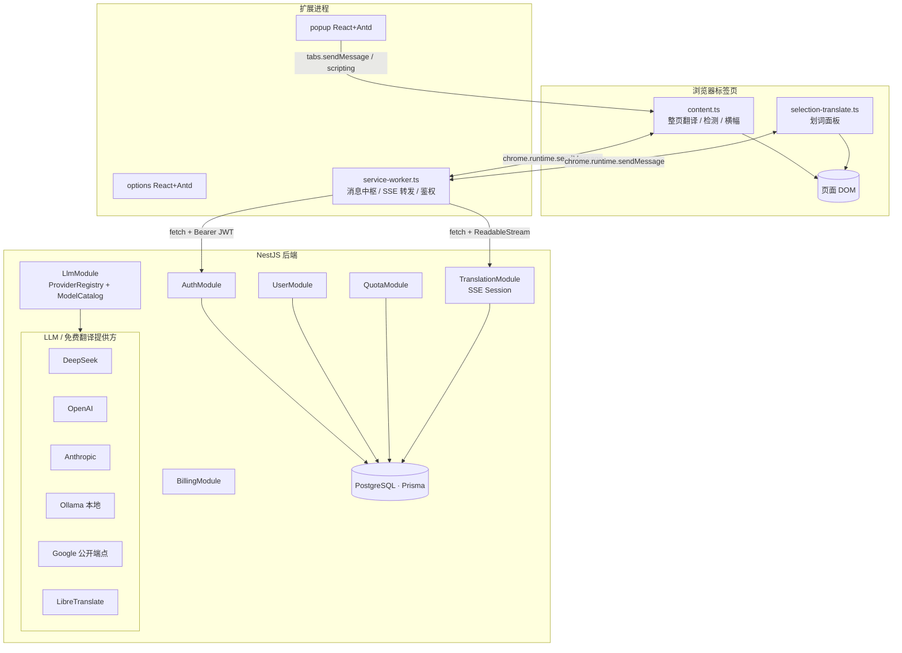
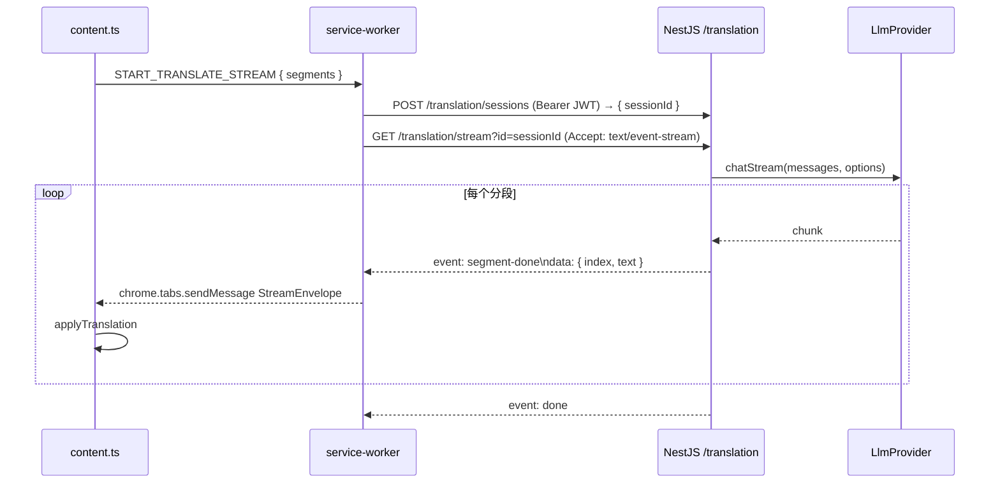
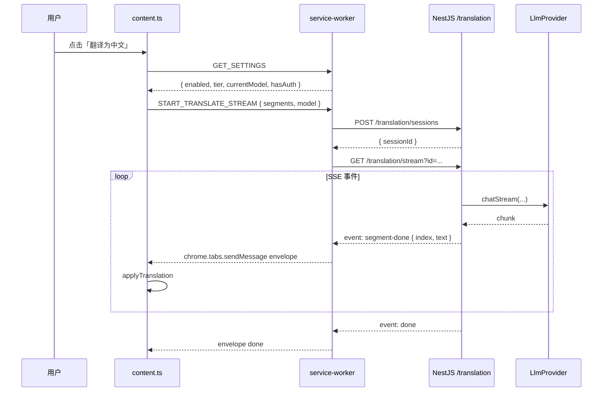
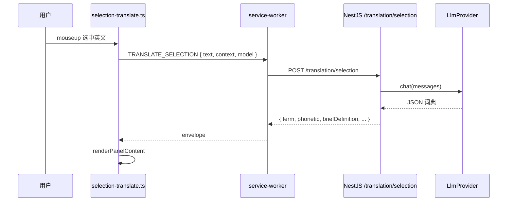
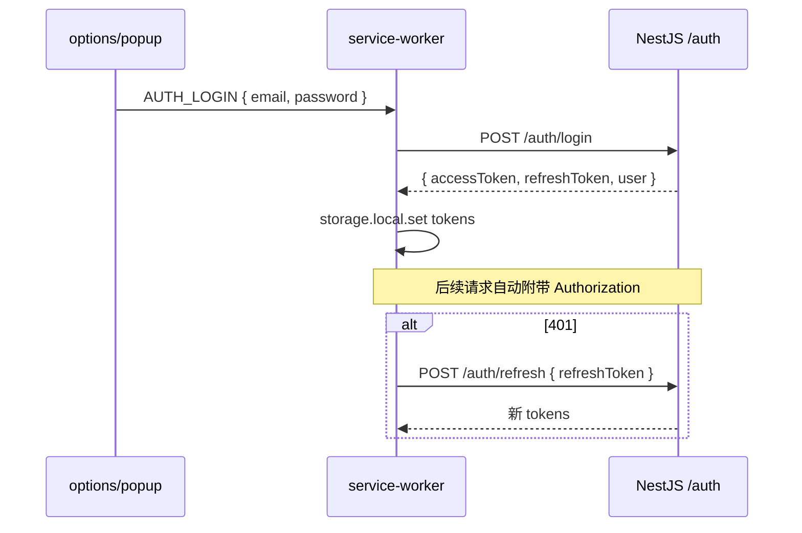

# AI 翻译助手 — 技术实现文档

> 文档版本：v2.0.0  
> 架构：pnpm + turborepo Monorepo  
> 前端：浏览器扩展（Manifest V3，Vite + React 19 + Ant Design）  
> 后端：NestJS 11 公共云服务，提供鉴权 / LLM 网关 / SSE 翻译流

---

## 1. 系统架构

### 1.1 总体架构图



### 1.2 仓库与子项目

```
translator/
├── apps/
│   ├── extension/   @translator/extension  (Vite + React 19 + Antd)
│   └── server/      @translator/server     (NestJS 11)
└── packages/
    ├── shared-types/    @translator/shared-types   (前后端共享 TS 类型)
    ├── llm-core/        @translator/llm-core       (LlmProvider 抽象)
    ├── eslint-config/   @translator/eslint-config  (base/react/node 三套预设)
    └── tsconfig/        @translator/tsconfig       (base/react/node 三套预设)
```

| 子项目                   | 作用                                                                |
| ------------------------ | ------------------------------------------------------------------- |
| `apps/extension`         | 浏览器扩展前端，构建产物即 MV3 插件                                 |
| `apps/server`            | NestJS 后端：鉴权、LLM 网关、SSE 翻译、用量配额                     |
| `packages/shared-types`  | DTO、`MembershipTier`、`ModelDescriptor`、`TranslateStreamEvent` 等 |
| `packages/llm-core`      | `LlmProvider` 接口、`ChatMessage`、`ChatStreamChunk`                |
| `packages/eslint-config` | ESLint 公共预设，通过 `exports` 字段暴露子配置                      |
| `packages/tsconfig`      | TypeScript 公共预设                                                 |

### 1.3 调度与缓存

- **包管理器**：`pnpm@9`，启用 workspace（`pnpm-workspace.yaml`）
- **任务编排**：`turborepo`，`turbo.json` 配置 `build` `dev` `lint` `typecheck` `clean`
- **命令惯例**：根 `pnpm <task>` → turbo 调度；子项目 `pnpm <task>` → 直接运行本地脚本

---

## 2. 后端实现（apps/server）

### 2.1 技术栈

- **框架**：NestJS 11、Express adapter
- **数据库**：PostgreSQL + **Prisma ORM 7.8.x**（`@prisma/adapter-pg` 驱动适配器，无 Rust query engine）
- **鉴权**：Passport（jwt 策略，可扩展 google / github / sms）
- **校验**：class-validator + class-transformer + zod（用于 env）
- **文档**：Swagger（`/docs`）
- **安全**：helmet、`@nestjs/throttler`（可选）、argon2 哈希
- **流式**：原生 `@Sse` 装饰器 + `Observable<MessageEvent>`

### 2.2 模块划分

```
src/
├── main.ts                  # bootstrap：全局管道/过滤器/拦截器、helmet、Swagger
├── app.module.ts            # 顶层模块
├── config/                  # ConfigModule + Zod 校验 + 类型化 AppConfigService
├── common/
│   ├── filters/             # HttpExceptionFilter（统一错误响应）
│   ├── interceptors/        # ResponseInterceptor / LoggingInterceptor
│   ├── decorators/          # @Public / @RequireTier / @CurrentUser
│   └── guards/              # JwtAuthGuard（全局）、MembershipGuard
├── types/express.d.ts       # 扩展 Express.User
└── modules/
    ├── prisma/              # PrismaModule + PrismaService（adapter-pg）
    ├── generated/prisma/    # Prisma 7 生成的 Client（纳入版本库）
    ├── prisma-types.ts      # 统一导出 Tier 等枚举，禁止 @prisma/client
    ├── auth/                # AuthModule：注册、登录、刷新、注销、OAuth/SMS 骨架
    ├── user/                # 当前用户与会员信息
    ├── quota/               # 配额与用量记录
    ├── billing/             # 订阅升级骨架（不接支付）
    ├── llm/
    │   ├── catalog/         # ModelCatalog：模型清单 / tier / keySource
    │   ├── registry/        # ProviderRegistry：注册 LlmProvider
    │   ├── providers/       # deepseek / openai / anthropic / ollama / google-free / libre-translate
    │   ├── llm.service.ts   # 解析 Key、调度 Provider
    │   └── llm.controller.ts# GET /llm/models 等
    ├── translation/         # 批翻译 / SSE 流式 / 划词翻译
    └── health/              # GET /health
```

### 2.3 鉴权与会员

- **全局守卫**：`JwtAuthGuard` + 反射 `@Public()` 例外
- **会员守卫**：`MembershipGuard` 配合 `@RequireTier('basic' | 'premium')` 拦截
- **JWT 策略**：
  - access token：短期（默认 15min），Header `Authorization: Bearer`
  - refresh token：长期（默认 7d），轮换并持久化到 `RefreshToken` 表
  - 兼容 SSE：`JwtStrategy.jwtFromRequest` 同时支持 Header 与 `?access_token=` query
- **OAuth/SMS**：策略与控制器骨架就位，标注 `// TODO` 提示接入官方 SDK 与短信通道

### 2.3.1 Prisma ORM 7

自 v2.0 起后端使用 **Prisma ORM 7.8.x**（非 v5 `prisma-client-js`）。开发、CI、生产均需 **Node.js ≥ 20.19**（仓库根目录 `.nvmrc` 当前为 `22.12.0`）。

#### 目录与配置

| 路径                                | 作用                                                                             |
| ----------------------------------- | -------------------------------------------------------------------------------- |
| `apps/server/prisma/schema.prisma`  | 模型定义；`generator` 使用 `prisma-client`，`output = "../src/generated/prisma"` |
| `apps/server/prisma.config.ts`      | CLI 用：`DATABASE_URL`、迁移目录、`db seed` 脚本                                 |
| `apps/server/src/generated/prisma/` | 生成的 Client（**纳入 Git**，避免 CI 未 generate 即编译失败）                    |
| `apps/server/src/prisma-types.ts`   | 业务层统一 `import { Tier, PrismaClient } from '.../prisma-types'`               |
| `apps/server/prisma/seed.ts`        | 开发种子数据（`tsx` 执行）                                                       |

`schema.prisma` 的 `datasource` **不再**写 `url = env("DATABASE_URL")`，改由 `prisma.config.ts` 提供。

#### 运行时连接

`PrismaService` 通过 `@prisma/adapter-pg` + `pg` 连接池访问 PostgreSQL，构造方式示意：

```ts
const adapter = new PrismaPg({ connectionString: appConfig.get('DATABASE_URL') });
super({ adapter });
```

禁止无 adapter 的 `new PrismaClient()`，禁止业务代码 `import from '@prisma/client'`。

#### 常用命令（在 `apps/server` 或 monorepo filter 下）

```bash
pnpm --filter @translator/server prisma:generate   # 改 schema 后生成 Client
pnpm --filter @translator/server prisma:migrate    # 开发：migrate dev
pnpm --filter @translator/server prisma:seed       # 开发：写入测试账号（不随 migrate 自动执行）
pnpm --filter @translator/server prisma:deploy     # 生产：migrate deploy
pnpm --filter @translator/server prisma:studio
```

**Prisma 7 行为变更**（与 v5/v6 不同）：

- `migrate dev` / `db push` **不会**自动执行 `generate`；`build` / `dev` 脚本已前置 `prisma generate`
- `migrate dev` / `migrate reset` **不会**自动执行 seed；需显式 `pnpm prisma:seed`
- CLI 默认**不**加载 `.env`，由 `prisma.config.ts` 顶部 `import 'dotenv/config'` 负责

#### 开发种子账号

执行 `pnpm prisma:seed` 后可用（密码均为 `dev-password-123`）：

| 邮箱                | 会员等级 |
| ------------------- | -------- |
| `free@dev.local`    | FREE     |
| `basic@dev.local`   | BASIC    |
| `premium@dev.local` | PREMIUM  |

#### 故障排查：`ERR_REQUIRE_ESM`

在 **Node 20.17 等低于 20.19** 的版本上运行 `prisma migrate` / `prisma generate` 时，可能出现：

```text
Error [ERR_REQUIRE_ESM]: require() of ES Module .../zeptomatch/dist/index.js ...
from .../@prisma/dev/dist/state.cjs not supported.
Node.js v20.17.0
```

| 项   | 说明                                                                                                                        |
| ---- | --------------------------------------------------------------------------------------------------------------------------- |
| 原因 | Prisma 7 CLI 为 ESM 工具链，且官方最低 Node 为 **20.19**；旧版 Node 的 CJS `require()` 无法加载 `zeptomatch` 等 ESM 依赖    |
| 处理 | 升级 Node（`nvm install` 读 `.nvmrc`）→ `node -v` 确认 ≥ 20.19 → `pnpm install` → 重试 `prisma:generate` / `prisma:migrate` |

### 2.4 LLM Provider 抽象

```ts
// packages/llm-core/src/provider.ts
export interface LlmProvider {
  readonly id: string; // 'deepseek' | 'openai' | ...
  readonly capabilities: ChatCapability[];
  chat(messages: ChatMessage[], options: ChatOptions): Promise<ChatResult>;
  chatStream?(messages: ChatMessage[], options: ChatOptions): AsyncIterable<ChatStreamChunk>;
}

export interface SimpleTranslator {
  readonly id: string;
  translate(text: string, opts: { source?: string; target: string }): Promise<string>;
}
```

后端 `ProviderRegistry` 在模块初始化时收集所有 `LlmProvider`，`LlmService` 根据模型 id 查找 Provider，并按下表解析 API Key：

| keySource | Key 解析逻辑                                                                |
| --------- | --------------------------------------------------------------------------- |
| `system`  | 从 `AppConfigService` 读取（仅高级会员可用，否则 `MembershipGuard` 已拦截） |
| `user`    | 从请求 body 中读取 `userApiKey`（来自扩展本地 storage）                     |
| `none`    | 免费 SDK，无需 Key                                                          |

### 2.5 翻译流（SSE）



要点：

- **会话存表**：`SseSession` 持久化原文与状态，便于断流重连与审计
- **失败降级**：单段解析失败回退 `SYSTEM_PROMPT_SINGLE` 重试；仍失败则发回原文并打 error 事件
- **中止**：前端 `AbortController.abort()` 触发 fetch 流关闭，后端检测 `req.on('close')` 标记会话取消
- **跨进程**：扩展中 `EventSource` 不能带自定义头，因此采用 `fetch + ReadableStream` 在 service worker 处理 SSE，再用 `chrome.tabs.sendMessage` 转发到 content

### 2.6 配额与计费

- `QuotaService.checkAndConsume(userId, modelId, units)`：根据 tier 配额表预扣
- `UsageLog` 表：每次成功翻译写入字符数 / 模型 / cost 估算
- `BillingModule`：套餐定义与「创建订阅 / 激活订阅」接口骨架，**不接支付渠道**，便于未来接入 Stripe/微信支付

---

## 3. 前端实现（apps/extension）

### 3.1 技术栈

- **框架**：React 19 + Ant Design 6（v6 已稳定发布，原生兼容 React 19）
- **构建**：Vite 5 + `@crxjs/vite-plugin`，多入口（popup / options / background / content×2）
- **状态**：Zustand（auth / prefs），React Query（接口数据缓存）
- **通信**：内部用 `chrome.runtime.sendMessage`，对外用统一 `fetch` 封装

### 3.2 目录

```
apps/extension/
├── src/
│   ├── manifest.ts                # 由 @crxjs/vite-plugin 处理的 MV3 清单 TS 版本
│   ├── background/
│   │   ├── service-worker.ts      # 消息中枢、SSE 转发、配置缓存、token 刷新
│   │   └── messages.ts            # BgMessage 联合类型 + Envelope 定义
│   ├── content/
│   │   ├── content.ts             # 整页翻译（含 `import './styles.css'`）
│   │   ├── selection-translate.ts # 划词翻译（含 `import './selection-panel.css'`）
│   │   ├── styles.css
│   │   └── selection-panel.css
│   ├── popup/                     # React 弹窗（main.tsx / App.tsx / popup.css）
│   ├── options/                   # React 选项页（含 AccountTab/ModelsTab/BehaviorTab）
│   └── shared/
│       ├── env.ts                 # VITE_API_BASE_URL
│       ├── api/                   # client.ts(统一 fetch) / auth / llm / translation / user / sse
│       ├── storage/               # chrome-storage 封装、KEYS 常量
│       ├── store/                 # Zustand: auth.store / prefs.store
│       ├── styles/theme.ts        # Antd 主题
│       └── utils/                 # language-detect / skip-selector（与 1.x 兼容并复用）
├── vite.config.ts                 # crx({ manifest }) + react()
├── tsconfig.json                  # 继承 packages/tsconfig/react.json
└── .eslintrc.cjs                  # 继承 @translator/eslint-config/react
```

### 3.3 多入口构建

- `@crxjs/vite-plugin` 自动从 `manifest.ts` 推断 popup / options / background / content 入口
- content scripts 的 CSS 通过 **JS `import`** 引入，由插件提取到 `assets/*.css` 并写回 manifest
- 产物落在 `apps/extension/dist`，**直接「加载已解压扩展」即可**

### 3.4 鉴权与请求

```ts
// shared/api/client.ts 中的 fetch 封装：
// - 自动附带 Authorization Bearer
// - 401 时调用 refresh，失败则清空 token 并广播 logout
// - 统一解包 { ok, data }
```

token 存储：

- access token：`chrome.storage.local`（不参与同步）
- refresh token：`chrome.storage.local`
- 用户自带模型 Key：`chrome.storage.local`
- 偏好（启用、当前模型、自动提示等）：`chrome.storage.sync`，跨设备同步

### 3.5 SSE 在扩展环境的实现

```ts
// shared/api/sse.ts
export async function* streamTranslation(sessionId, signal): AsyncIterable<TranslateStreamEvent> {
  const res = await fetch(`${API_BASE_URL}/translation/stream?id=${sessionId}`, {
    headers: { Authorization: `Bearer ${token}`, Accept: 'text/event-stream' },
    signal,
  });
  const reader = res.body!.getReader();
  // 按 \n\n 拆分 event 块，解析 event/data 字段
}
```

service worker 中 `startStream()`：

1. 调后端 `POST /translation/sessions` 拿到 `sessionId`
2. 启动 `streamTranslation` 消费迭代器
3. 每个事件通过 `chrome.tabs.sendMessage(tabId, StreamEnvelope)` 转发
4. content 脚本接收后调用 `applyTranslation` 写 DOM

### 3.6 内容脚本（content scripts）

- 保留 **vanilla TS**，不用 React：注入页是「隔离世界」，且第三方页面对额外 React 树非常敏感
- 关键 API：
  - `detectEnglishPage()` 复用 1.x 检测逻辑
  - `isInsideSkipContainer()` 通过 `closest(SKIP_SELECTOR)` 判断祖先，兼容 hljs 嵌套 span
  - `IntersectionObserver` + 滚动 / Mutation 防抖
- 与后台通信走 `BgMessage`：`START_TRANSLATE_STREAM` / `ABORT_TRANSLATE_STREAM` / `TRANSLATE_SELECTION` 等

---

## 4. 共享 Packages

### 4.1 `shared-types`

- `MembershipTier`、`isTierAtLeast` 工具
- `ModelDescriptor` / `ProviderDescriptor` / `KeySource` / `ModelCapability`
- `TranslateBatchRequest` / `TranslateBatchResponse` / `TranslateStreamEvent`
- `TranslateSelectionRequest` / `TranslateSelectionResponse`
- 认证：`AuthLoginDto` / `AuthRegisterDto` / `UserProfile` / `OAuthProvider`
- 通用：`ApiResponse<T>` / `Paginated<T>`

### 4.2 `llm-core`

- `LlmProvider`、`SimpleTranslator` 接口
- `ChatMessage` / `ChatOptions` / `ChatUsage` / `ChatResult` / `ChatStreamChunk`
- 仅依赖 TypeScript，不引入 NestJS / React，前后端复用

### 4.3 `eslint-config` & `tsconfig`

均通过 `package.json#exports` 暴露多入口（如 `./react` / `./node`），子项目使用：

```js
// .eslintrc.cjs
module.exports = { extends: ['@translator/eslint-config/react'] };
```

```json
// tsconfig.json
{ "extends": "@translator/tsconfig/react.json" }
```

---

## 5. 关键技术决策

| 决策                | 选型                                | 理由                                                               |
| ------------------- | ----------------------------------- | ------------------------------------------------------------------ |
| Monorepo 工具       | pnpm workspace + turborepo          | 高速安装、缓存任务、与 IDE 兼容好                                  |
| 流式协议            | SSE（fetch + ReadableStream）       | 浏览器原生支持；扩展中 `EventSource` 无法带 token，遂用 fetch 实现 |
| 后端框架            | NestJS 11                           | 模块化、强类型、装饰器友好；自带 SSE / Swagger / Guard             |
| LLM 抽象            | `LlmProvider` 接口 + 注册中心       | 后端可零侵入接入新模型，前端通过 `/llm/models` 自适应渲染          |
| 会员与 Key 来源解耦 | `MembershipTier` + `KeySource` 二维 | 同一模型可在不同套餐下呈现不同 Key 来源（user vs system）          |
| 内容脚本不用 React  | vanilla TS + 原生 DOM               | 注入页性能与隔离世界兼容性优先；React 适合在 popup/options 中使用  |
| 行尾配置            | Prettier `endOfLine: 'auto'`        | Windows/Linux 跨平台贡献者协作；由 git 处理换行符                  |
| Antd 版本           | v6（latest）                        | v6 已 GA 并原生兼容 React 19，体积更小，按需移除 v5 patch          |
| 密钥分层            | 用户 Key 本地 + 系统 Key 后端 env   | 同时支持 BYOK 与 SaaS 商业模型                                     |

---

## 6. 数据流时序

### 6.1 整页流式翻译



### 6.2 划词翻译



### 6.3 登录 + 鉴权刷新



---

## 7. 已知限制与风险

| 类别        | 描述                                       | 影响                           |
| ----------- | ------------------------------------------ | ------------------------------ |
| DOM 翻译    | 直接改 `textContent`，破坏站点内联事件绑定 | 部分交互组件异常               |
| SPA         | 动态路由可能重复注册或漏译                 | 需 MutationObserver，仍不完美  |
| iframe      | `all_frames: false`                        | 嵌入页不翻译                   |
| Shadow DOM  | 未穿透                                     | Web Components 内文本漏译      |
| OAuth / SMS | 仅骨架，未对接真实 SDK                     | 暂只能使用邮箱密码登录         |
| 支付        | BillingModule 不真正扣费                   | 会员升级需手工运维             |
| Antd 体积   | `theme` chunk gzip ~200KB                  | 选项页首屏稍重，未来可按需引入 |
| 速率限制    | 后端未默认接 throttler/redis               | 高并发下需补充                 |

---

## 8. 构建、调试与发布

### 8.1 安装与运行

```bash
pnpm install
pnpm dev                # 同时启动前后端
pnpm dev:web            # 仅扩展
pnpm dev:server         # 仅后端
```

### 8.2 构建产物

```bash
pnpm build              # 全部子项目
pnpm build:web          # 仅扩展 → apps/extension/dist
pnpm build:server       # 仅后端 → apps/server/dist
```

### 8.3 加载扩展

1. `chrome://extensions` → 开发者模式 → 加载已解压
2. 选择 `apps/extension/dist`
3. 打开选项页登录并选择模型

### 8.4 后端调试

- Swagger：`http://localhost:19696/docs`
- 日志：`LoggingInterceptor` 输出请求/响应耗时与状态
- 数据库：先 `docker compose up -d`（`apps/server`）→ `prisma:migrate` → 可选 `prisma:seed`（见 [§2.3.1](#231-prisma-orm-7)）
- Prisma Studio：`pnpm --filter @translator/server prisma:studio`（需 Node ≥ 20.19）
- Prisma CLI 报错 `ERR_REQUIRE_ESM`：见 [§2.3.1 故障排查](#231-prisma-orm-7)

### 8.5 调试入口

| 组件            | 调试方式                                         |
| --------------- | ------------------------------------------------ |
| Content Script  | 页面 DevTools → Console（过滤扩展 ID）           |
| Service Worker  | `chrome://extensions` → Service Worker → Inspect |
| Popup / Options | 右键扩展图标 → 检查弹出内容                      |
| Backend         | `pnpm dev:server` + IDE debug attach             |

---

## 9. 后续功能开发计划

### 阶段一：体验与稳定性（v2.1）

| 优先级 | 功能               | 说明                                       |
| ------ | ------------------ | ------------------------------------------ |
| P0     | 一键恢复原文       | 基于 `data-ds-original` 回滚，无需刷新页面 |
| P0     | 域名黑/白名单      | 选项页配置，按域名自动开启或永不提示       |
| P0     | 错误重试与指数退避 | API 429/5xx 时友好提示并自动重试           |
| P1     | 翻译缓存           | 后端 Redis + 前端 chrome.storage.local     |
| P1     | 快捷键             | `Alt+T` 触发翻译、`Esc` 关闭横幅           |
| P2     | 多目标语言         | 简体 / 繁体 / 日 / 韩                      |

### 阶段二：账号与商业化（v2.2）

| 优先级 | 功能                           | 说明                                         |
| ------ | ------------------------------ | -------------------------------------------- |
| P0     | OAuth Google / GitHub 真实接入 | passport-google-oauth20 / passport-github2   |
| P0     | 短信验证码                     | 阿里云 / 腾讯云 SMS                          |
| P0     | Stripe 订阅                    | BillingModule 对接 Stripe Checkout + Webhook |
| P1     | 用量面板                       | 选项页展示日/月翻译字符数                    |
| P1     | 套餐变更与发票                 | 升级/降级即时生效，按比例返还                |
| P2     | 团队账号                       | 多人共享配额                                 |

### 阶段三：能力扩展（v2.3）

| 优先级 | 功能                | 说明                        |
| ------ | ------------------- | --------------------------- |
| P0     | iframe / Shadow DOM | 安全穿透并翻译              |
| P0     | PDF / 打印友好      | 可选新标签页纯译文视图      |
| P1     | 术语表              | 用户级 / 域名级；后端持久化 |
| P1     | 双语对照模式        | 原文悬停或并排展示          |
| P2     | 划词快捷键 / 双击   | 自定义触发方式              |

### 阶段四：智能化（v3.0 愿景）

- 基于页面类型的自动 Prompt（新闻 / 论文 / 代码文档）
- 图表 OCR + 译文叠加（需额外 OCR 服务）
- 阅读进度与「未译章节」导航
- 与 Cursor / Notion 等工具的划词联动

---

## 10. 附录

### 10.1 重要环境变量

**`apps/server/.env`**：

| 变量名                                           | 必填 | 用途                                                          |
| ------------------------------------------------ | ---- | ------------------------------------------------------------- |
| `DATABASE_URL`                                   | ✓    | PostgreSQL 连接串（`prisma.config.ts` + 运行时 adapter 共用） |
| `JWT_SECRET`                                     | ✓    | access / refresh 共用签名密钥（≥32 字符）                     |
| `JWT_ACCESS_TTL_SEC`                             |      | access token 秒数，默认 3600                                  |
| `JWT_REFRESH_TTL_SEC`                            |      | refresh token 秒数，默认 2592000（30 天）                     |
| `OLLAMA_BASE_URL`                                |      | 本地 Ollama 地址                                              |
| `DEEPSEEK_API_KEY`                               |      | 高级会员调用 DeepSeek 时使用                                  |
| `OPENAI_API_KEY`                                 |      | 高级会员调用 OpenAI 时使用                                    |
| `ANTHROPIC_API_KEY`                              |      | 高级会员调用 Anthropic 时使用                                 |
| `LIBRE_TRANSLATE_BASE_URL`                       |      | LibreTranslate 实例地址（默认官方托管）                       |
| `LIBRE_TRANSLATE_API_KEY`                        |      | 官方托管 API Key（可选；自建通常留空）                        |
| `GOOGLE_OAUTH_*`                                 |      | OAuth 接入占位                                                |
| `GITHUB_OAUTH_*`                                 |      | OAuth 接入占位                                                |
| `SMS_PROVIDER` / `SMS_API_KEY` / `SMS_SIGN_NAME` |      | 短信通道（默认 `mock`）                                       |
| `OAUTH_CALLBACK_BASE_URL`                        |      | OAuth 回调基址                                                |

**`apps/extension/.env`**：

| 变量名              | 必填 | 用途                                |
| ------------------- | ---- | ----------------------------------- |
| `VITE_API_BASE_URL` | ✓    | 后端基础地址（默认本地 19696 端口） |

### 10.2 相关链接

- [DeepSeek API 文档](https://platform.deepseek.com/api-docs/)
- [OpenAI API](https://platform.openai.com/docs/)
- [Anthropic API](https://docs.anthropic.com/)
- [Chrome Extension MV3](https://developer.chrome.com/docs/extensions/mv3/)
- [@crxjs/vite-plugin](https://crxjs.dev/vite-plugin)
- [Ant Design 6 文档](https://ant.design/)
- [Angular Commit 规范](https://github.com/angular/angular/blob/main/contributing-docs/commit-message-guidelines.md)

---

_本文档描述「怎么做」与「往哪做」；业务需求见《需求功能文档》。_
