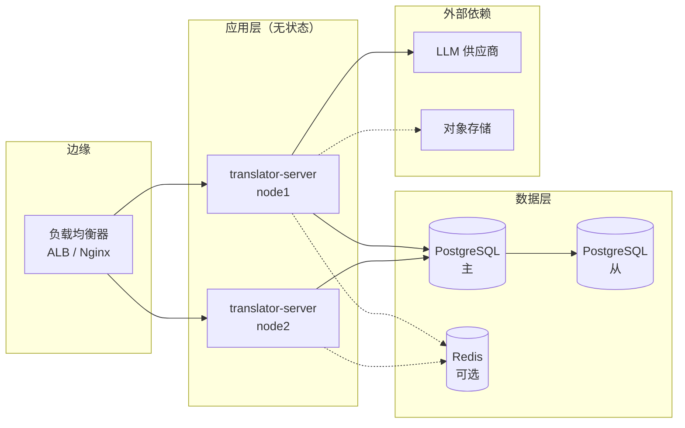

# 部署文档（TODO）

> 状态：📝 **大纲版**，待补充镜像仓库地址、CI/CD 配置、IaC 模板等实际制品。  
> 适用对象：DevOps / 平台工程 / 首次接手部署的开发同学。  
> 关联文档：[生产环境启动文档](生产环境启动文档.md) · [技术实现文档](技术实现文档.md)

---

## 0. 待办（按优先级）

- [ ] 选定容器镜像仓库（Harbor / ACR / GHCR / Docker Hub）并填入地址
- [ ] 编写 `apps/server/Dockerfile`（多阶段构建）
- [ ] 编写 `docker-compose.prod.yml`（含 PG / Redis / Nginx）
- [ ] 接入 CI/CD（GitHub Actions / GitLab CI / Jenkins）
- [ ] IaC 模板（Terraform / Pulumi / Ansible）
- [ ] 浏览器扩展自动签名与商店上架流水线
- [ ] 蓝绿 / 金丝雀策略落地
- [ ] 灾备方案（异机房 / 跨可用区）

---

## 1. 部署架构

> TODO：补充实际拓扑图（建议用 mermaid 或 draw.io）。



---

## 2. 后端容器化

### 2.1 Dockerfile（TODO 模板）

> 以下为参考结构，需根据实际镜像基线、CA 证书、时区调整。

```dockerfile
# ---- 构建阶段 ----
FROM node:20-alpine AS builder
RUN corepack enable && corepack prepare pnpm@9 --activate
WORKDIR /workspace

# 复制 workspace 元信息以最大化缓存命中
COPY pnpm-workspace.yaml package.json pnpm-lock.yaml turbo.json tsconfig.base.json ./
COPY packages ./packages
COPY apps/server ./apps/server

RUN pnpm install --frozen-lockfile --filter @translator/server...
RUN pnpm --filter @translator/server build

# ---- 运行阶段 ----
FROM node:20-alpine AS runner
WORKDIR /app
ENV NODE_ENV=production TZ=Asia/Shanghai
RUN apk add --no-cache tini tzdata

# 只拷贝运行所需
COPY --from=builder /workspace/apps/server/dist ./dist
COPY --from=builder /workspace/apps/server/node_modules ./node_modules
COPY --from=builder /workspace/apps/server/prisma ./prisma
COPY --from=builder /workspace/apps/server/package.json ./

EXPOSE 19696
ENTRYPOINT ["/sbin/tini","--"]
CMD ["node", "dist/main.js"]
```

> ⚠️ TODO：评估是否需要将 prisma engines 一并打入（Alpine 需要 `openssl` & `libstdc++`）；
> 若用 Debian slim 镜像更稳妥但体积变大。

### 2.2 docker-compose（开发期联调）

`apps/server/docker-compose.yml` 已存在 PG 配置，生产建议拆分专用 compose 或转向 Kubernetes。

> TODO：补充 `docker-compose.prod.yml`（含 Nginx、Redis、可选 LibreTranslate）。

---

## 3. 浏览器扩展产物

扩展是静态文件，不需要服务器运行时。

### 3.1 构建

```bash
pnpm --filter @translator/extension build
# 产物：apps/extension/dist
```

### 3.2 打包发布

> TODO：补充自动化脚本，建议生成 `translator-extension-<version>.zip`。

```bash
# 示意
cd apps/extension/dist && zip -r ../release/translator-extension-2.0.0.zip .
```

### 3.3 商店上架

> TODO：填入 Chrome Web Store Item ID、Edge Add-ons Product ID。

- Chrome：https://chrome.google.com/webstore/devconsole/
- Edge：https://partner.microsoft.com/dashboard/microsoftedge

---

## 4. CI/CD

### 4.1 推荐流水线（GitHub Actions 示例 — TODO）

```yaml
# .github/workflows/ci.yml （待编写）
name: CI
on: [push, pull_request]
jobs:
  test:
    runs-on: ubuntu-latest
    steps:
      - uses: actions/checkout@v4
      - uses: pnpm/action-setup@v4
        with: { version: 9 }
      - uses: actions/setup-node@v4
        with: { node-version: '20', cache: 'pnpm' }
      - run: pnpm install --frozen-lockfile
      - run: pnpm typecheck
      - run: pnpm lint
      - run: pnpm build
```

### 4.2 制品发布流水线（TODO）

| 阶段              | 动作                                        |
| ----------------- | ------------------------------------------- |
| Tag 触发          | `v*.*.*` push 触发                          |
| 构建后端镜像      | docker build → 推送 registry，tag = git tag |
| 打包扩展产物      | 生成 zip，作为 release artifact             |
| 通知              | 飞书 / 钉钉 webhook                         |
| 部署到 staging    | 自动                                        |
| 部署到 production | 人工审批                                    |

### 4.3 数据库迁移在 CI 中的位置

> TODO：决策点 —— 由 CI 触发 `prisma migrate deploy`，还是由应用启动时执行？
> 推荐 CI 触发（避免应用并发启动多次迁移）。

---

## 5. 配置与密钥管理

### 5.1 密钥分类

| 等级   | 示例                           | 推荐管理方式                        |
| ------ | ------------------------------ | ----------------------------------- |
| 极敏感 | DB 密码 / JWT secret / LLM Key | KMS / Vault；运行时注入，不写入镜像 |
| 一般   | CORS 域名 / 端口               | ConfigMap / 环境变量                |
| 公开   | 版本号 / git commit            | 镜像 label                          |

### 5.2 注入方式

> TODO：根据基础设施选定 —— K8s Secret / Docker secrets / systemd EnvironmentFile / Vault Agent。

---

## 6. 数据库变更（Migration）

### 6.1 流程

```bash
# 1. 本地修改 prisma/schema.prisma 后
pnpm --filter @translator/server prisma:migrate dev --name <change-desc>

# 2. 提交生成的迁移文件到仓库
git add apps/server/prisma/migrations
git commit -m "feat(server): <数据库变更说明>"

# 3. CI/CD 在部署前执行
pnpm --filter @translator/server prisma:deploy
```

### 6.2 高风险操作清单

| 操作          | 风险                         | 缓解措施                              |
| ------------- | ---------------------------- | ------------------------------------- |
| 删除字段      | 兼容窗口外的旧版本应用会报错 | 先废弃 → 下版本再删                   |
| 重命名字段    | 同上                         | 双写过渡（新增 → 双写 → 切换 → 删除） |
| 大表加索引    | 锁表 / 长时间复制            | `CREATE INDEX CONCURRENTLY`           |
| 跨表 backfill | 长事务、锁                   | 后台 worker 分批                      |

---

## 7. 蓝绿 / 金丝雀

> TODO：选定策略后补充具体配置。

### 7.1 方案对比

| 方案   | 适用              | 复杂度 | 资源成本 |
| ------ | ----------------- | ------ | -------- |
| 滚动   | 默认              | 低     | 低       |
| 蓝绿   | 不可容忍中间态    | 中     | 2x       |
| 金丝雀 | 按比例 / 用户灰度 | 中-高  | 1.1-2x   |

### 7.2 关键约束

- 数据库 schema 必须**前向兼容**（新旧应用同时跑）
- SSE 连接需考虑切流时的优雅关闭
- JWT 签名 secret 切换需双密钥过渡期

---

## 8. 灾备

> TODO：根据 SLA 目标（RTO / RPO）补充细则。

| 场景               | RPO 目标 | RTO 目标 | 方案                      |
| ------------------ | -------- | -------- | ------------------------- |
| 应用节点故障       | 0        | < 1 min  | 自动重启 + 负载均衡剔除   |
| AZ 故障            | 0        | < 5 min  | 多 AZ 部署                |
| 区域故障           | < 15 min | < 30 min | 异地热备 / 冷备           |
| 数据库主故障       | < 1 min  | < 5 min  | 主从切换 + 应用自动重连   |
| LLM 上游全部不可用 | -        | -        | 自动降级到免费引擎 + 告警 |

---

## 9. 安全合规

- [ ] 镜像扫描（Trivy / Grype）已接入 CI
- [ ] 依赖漏洞扫描（pnpm audit / Dependabot）已开启
- [ ] 生产 SSH 仅跳板机；禁止开 root 直连
- [ ] 审计日志保留 ≥ 180 天
- [ ] 备份加密（at rest + in transit）
- [ ] 与法务确认隐私政策、用户协议（涉及邮箱 + 翻译内容收集）

---

## 10. 验收清单

```
[ ] CI 全部 green，制品已推送
[ ] 数据库迁移已在 staging 验证
[ ] staging 环境完整流程冒烟（注册 → 登录 → 整页翻译 → 划词翻译 → 模型切换）
[ ] 关键告警与值班排班已确认
[ ] 回滚剧本已演练
[ ] 用户公告已准备（如有 BREAKING CHANGE）
```

---

## 11. 附：常见运维命令速查

```bash
# 查看后端日志（pm2）
pm2 logs translator-server --lines 200

# 查看后端日志（Docker）
docker logs --tail 200 -f translator-server

# 进入容器排查
docker exec -it translator-server sh

# 数据库连接测试
psql "$DATABASE_URL" -c "SELECT 1"

# Prisma Studio（仅本地 / 跳板）
pnpm --filter @translator/server prisma:studio

# 强制刷新生产配置（无 reload，等同于全量重启）
pm2 restart translator-server --update-env
```
